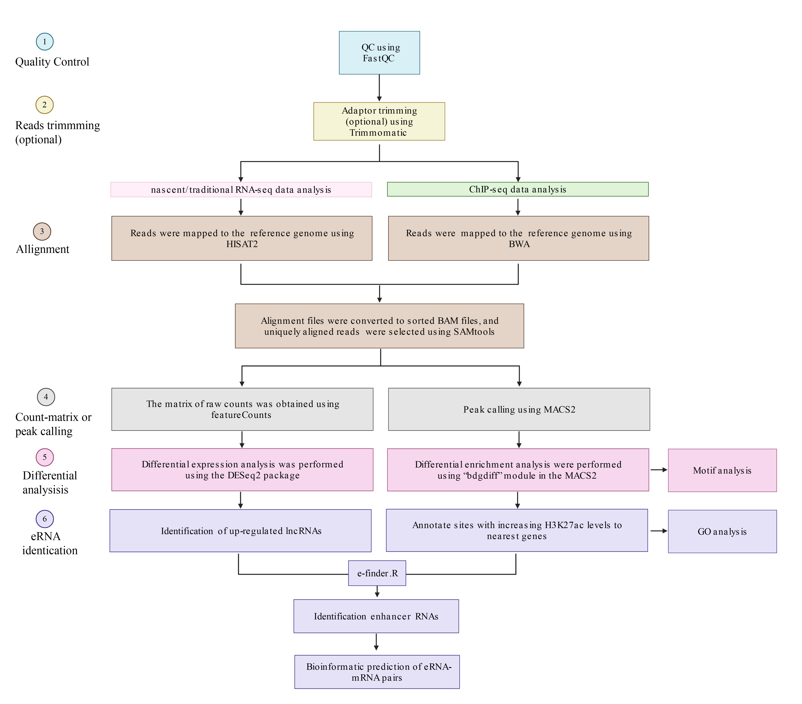

# e-finder

This page contains bash and R codes for the enhancer RNA identification (e-finder) pipeline used in "Transcriptome-wide profiling of nascent RNA in neurons with enriched H3K27ac signal elevates eRNAs identification efficiency".


## Workflow

The diagram below outlines a general workflow of e-finder. Code corresponding to each step can be found within  this directory. Detailed information can be found within the Methods section of the manuscript. 



## Step 0: Download packages/tools and prepare environment

To run the pipeline, you will need to install Python 2.7+ and ensure the following packages can be imported: FastQC, Trimmomatic, BWA, SAMtools, MACS2, bedtools, HISAT2, and featureCounts.

To visualize the results, we recommend using the WashU Epigenome Browser, a web-based genomic data exploration tool that provides visualization, integration, and analysis of epigenomic datasets. You can find the browser at http://epigenomegateway.wustl.edu


## Step 1: Quality Control
## QC using Fastqc
Raw sequencing data can be assessed using FastQC. Use the code below to run FastQC on all your fastq.gz files:
```
ls *.fastq.gz |xargs fastqc
```

## Step 2: Reads trimmming (optional)
Low-quality nucleotides (Phred < 20) and Illumina adaptor sequences were trimmed by Trimmomatic.
```
java -jar trimmomatic-0.35.jar PE  input_forward.fq.gz input_reverse.fq.gz output_forward_paired.fq.gz output_forward_unpaired.fq.gz output_reverse_paired.fq.gz output_reverse_unpaired.fq.gz ILLUMINACLIP:TruSeq3-PE.fa:2:30:10 LEADING:3 TRAILING:3 SLIDINGWINDOW:4:20 MINLEN:36

```
This code performs the following: 
```
PE for paired-end reads  
Remove adapters (ILLUMINACLIP:TruSeq3-PE.fa:2:30:10);  
Remove leading low quality or N bases (below quality 3) (LEADING:3);   
Remove trailing low quality or N bases (below quality 3) (TRAILING:3);  
Scan the read with a 4-base wide sliding window, cutting when the average quality per base drops below 20 (SLIDINGWINDOW:4:20)  
Drop reads below the 36 bases long (MINLEN:36)  
```


## Step 3: Alignment
After quality control and reads trimming (optional), you can map RNA-seq or ChIP-seq reads to the reference genome.

## RNA-seq
For RNA-seq, use the following command for the alignment:
```
hisat2  -x <hisat2-idx> -1 <m1> -2 <m2> | samtools sort -o out.bam

  <ht2-idx>  Index filename prefix (minus trailing .X.ht2).
  <m1>       Files with #1 mates, paired with files in <m2>.
             Could be gzip'ed (extension: .gz) or bzip2'ed (extension: .bz2).
  <m2>       Files with #2 mates, paired with files in <m1>.
             Could be gzip'ed (extension: .gz) or bzip2'ed (extension: .bz2).
```

### ChIP-seq
for ChIP-seq with Illumina single-end reads shorter than ~70bp, use the following command for the alignment:
```
bwa aln ref.fa reads.fq > reads.sai; 
bwa samse ref.fa reads.sai reads.fq > aln-se.sam
```
For other types of ChIP-seq data, please refer to manual of [BWA](https://github.com/lh3/bwa)


## Step 4: Count-matrix or peak calling

## RNA-seq
For RNA-seq, use the following command for quantification:
```
featureCounts -p --countReadPairs -t exon -g gene_id -a annotation.gtf -o counts.txt library1.bam library2.bam library3.bam
```

The '-p' flag specifies that input data contain paired-end reads. 'featureCounts' will terminate if the type of input reads (single-end or paired-end) is different from the specified type. To count fragments (instead of reads) for paired-end reads, the '--countReadPairs' parameter should also be specified.

## ChIP-seq
For ChIP-seq, use the following command for peak calling:
```
macs2 callpeak -t ChIP.bam -c Control.bam -f BAM \
 -g mm -q 0.05 --nomodel --extsize 150 --bdg 
```

	-t/--treatment FILENAME
	-c/--control
	-f/--format FORMAT
	-g/--gsize PLEASE assign this parameter to fit your needs!
				hs: 2.7e9
				mm: 1.87e9
				ce: 9e7
				dm: 1.2e8
	-q/--qvalue The q-value (minimum FDR) cutoff to call significant regions. Default is 0.05. For broad marks, you can try 0.05 as the cutoff. Q-values are calculated from p-values using the Benjamini-Hochberg procedure.
	--nomodel While on, MACS will bypass building the shifting model.
	--extsize While --nomodel is set, MACS uses this parameter to extend reads in 5'->3' direction to fix-sized fragments. For example, if the size of the binding region for your transcription factor is 200 bp, and you want to bypass the model building by MACS, this parameter can be set as 200. This option is only valid when --nomodel is set or when MACS fails to build model and --fix-bimodal is on.
	-B/--bdg If this flag is on, MACS will store the fragment pileup, control lambda in bedGraph files. The bedGraph files will be stored in the current directory named NAME_treat_pileup.bdg for treatment data, NAME_control_lambda.bdg for local lambda values from control.


## Step 5: Differential analysis
In this step, differentail gene lists and sites with differential H3K27ac levels under two conditions were obtained.   
For RNA-seq, the "Up_lncRNAs_command.R" script can be used.  
For ChIP-seq, the following command can be used:
```
macs2 bdgdiff --t1 T1BDG --t2 T2BDG --c1 C1BDG --c2 C2BDG [-C CUTOFF] [-l MINLEN] [--d1 DEPTH1] [--d2 DEPTH2] --o-prefix OPREFIX 


  --t1 T1BDG            MACS pileup bedGraph for condition 1. Incompatible with callpeak --SPMR output. REQUIRED  
  --t2 T2BDG            MACS pileup bedGraph for condition 2. Incompatible with callpeak --SPMR output. REQUIRED  
  --c1 C1BDG            MACS control lambda bedGraph for condition 1. Incompatible with callpeak --SPMR output. REQUIRED  
  --c2 C2BDG            MACS control lambda bedGraph for condition 2. Incompatible with callpeak --SPMR output. REQUIRED  
  -C CUTOFF, --cutoff CUTOFF logLR cutoff. DEFAULT: 3 (likelihood ratio=1000)  
  -l MINLEN, --min-len MINLEN Minimum length of differential region. Try bigger value to remove small regions. DEFAULT: 200  
  --d1 DEPTH1, --depth1 DEPTH1 Sequencing depth (# of non-redundant reads in million) for condition 1. It will be used together with --d2. See description for --d2 below for how to assign them. Default: 1  
  --d2 DEPTH2, --depth2 DEPTH2 Sequencing depth (# of non-redundant reads in million) for condition 2. It will be used together with --d1. DEPTH1 and DEPTH2 will be used to calculate scaling factor for each sample, to down-scale larger sample to the level of smaller one. For example, while comparing 10 million condition 1 and 20 million condition 2, use --d1 10 --d2 20, then pileup value in bedGraph for condition 2 will be divided by 2. Default: 1  
```


## Step 6: eRNA Identification

### 6.1 'Up_lncRNAs_command.R' & 'Annotation_command.R'
Up-regulated lncRNAs can be identified using the `Up_lncRNAs_command.R` script. The H3K27ac peak regions (BED file) can be annotated using the `Annotation_command.R` script. Both `Up_lncRNAs_command.R` and `Annotation_command.R` use `config_lncRNA.6.1.txt` as the configuration file. Users need to copy this configuration file to the current working directory and specify the input file name, output file name, and parameters in `config_lncRNA.6.1.txt` to tailor the analysis.

### 6.2 'e-finder.R'
The identification of enhancer RNAs and the bioinformatic prediction of eRNA-mRNA pairs can be performed using the `e-finder.R` script. `e-finder.R` uses `config_e-finder.6.2.txt` as the configuration file. Users need to copy this configuration file to the current working directory and specify the input file name, output file name, and parameters in `config_e-finder.6.2.txt` to tailor the analysis.


## END